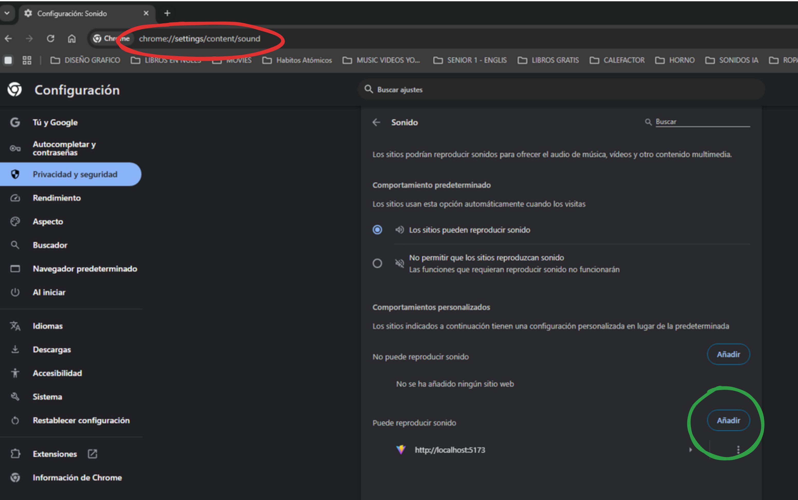
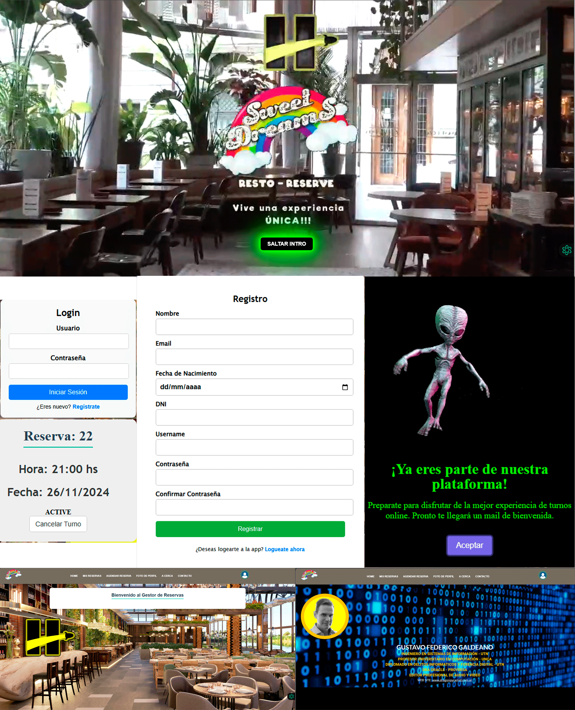

## **IMPORTANTE: PARA QUE LA APLICACION PUEDA MOSTRAR UNA BUENA EXPERIENCIA DEL USUARIO, DEBES HABILITAR EN EL NAVEGADOR QUE PUEDA REPRODUCIR SONIDO EN EL SERVIDOR http://localhost:5173/, en Google Chrome la ruta es chrome://settings/content/sound**

# **SWEET DREAMS - RESTO RESERVE**

Te presentamos una app que te facilita el proceso de una reserva en un restaurant. Con esta aplicación podrás realizar una reserva de manera rápida y sencilla. Solo necesitas seleccionar la fecha y hora de tu preferencia.  Además, si deseas cancelar la reserva , solo necesitas hacer clic en el botón de cancelar. Que la experiencia sea única y memorable!

### **Descripción**:
Este proyecto tiene como fin generar reservas para los clientes de un restaurante. El usuario podrá seleccionar la fecha y hora de su preferencia y realizar la reserva. Además, podrá cancelar la reserva si lo desea.

## **_TECNOLOGÍAS USADAS_**

### _FRONT-END_

REACT

VITE

### _BACK-END_

EXPRESS

TYPEORM

### _DATA BASE_

POSTGRESQL

## _TAREAS REALIZADAS EN EL PROYECTO_

- Creación de backend utilizando express, TypeORM y PostgreSQL.

- Creación de frontend utilizando React y Vite.

